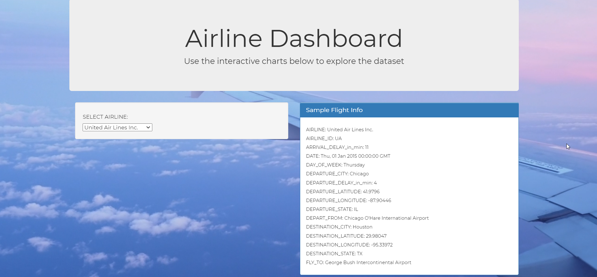
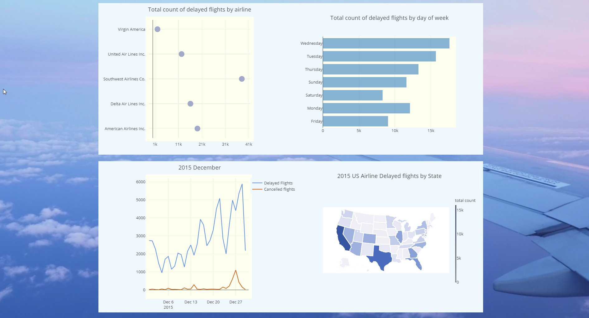
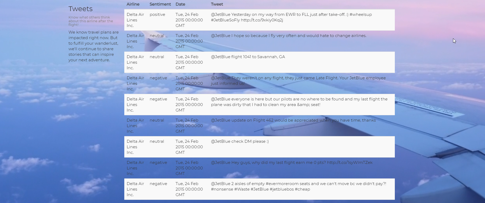

# Airline_Visualization
- In this project, we use the airline data from before and visualize delayed (and cancelled) flights data by its features. 
- We build a python-powered flask app and then use javascript to add graphs on it. 
- The database used is mongodb. 
- For the background, we use bideo.js to have a full screen video playing. 

## There are some screenshoot of the final result:

